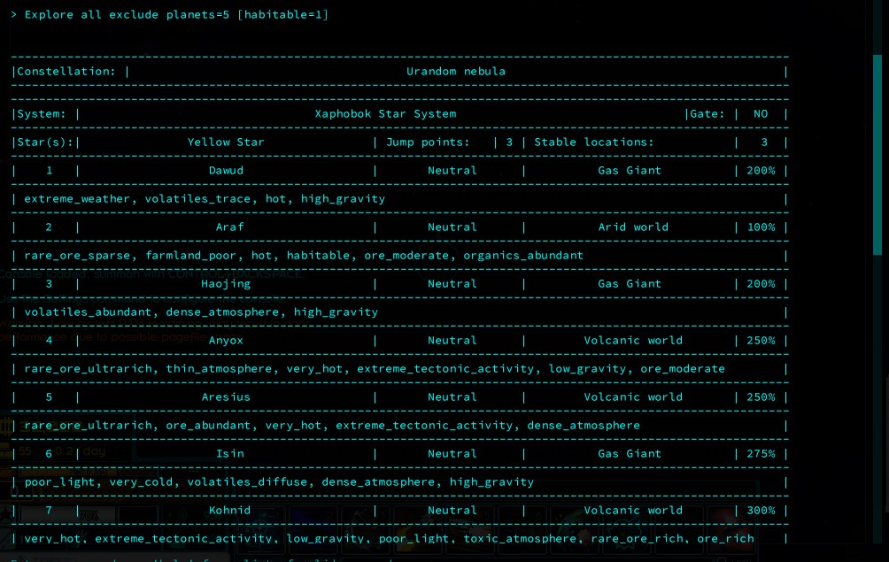
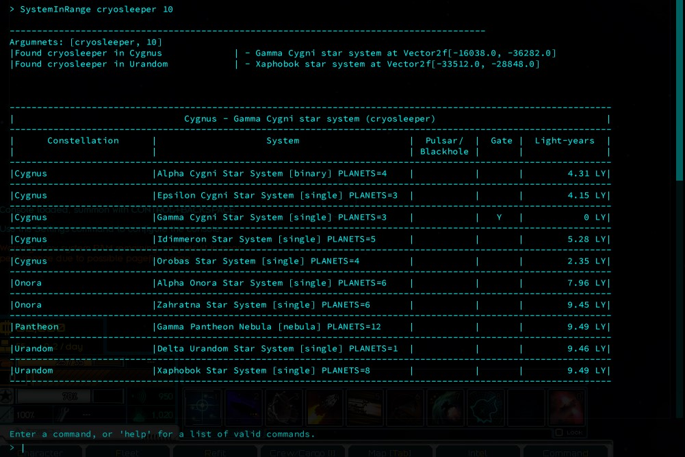

# Explore_the_galaxy

A console script for Starsector
  

**IMPORTANT NOTICE**: Better Colonies' AddAdminBC command can cause errors with this mod. It's a known issue and the only way around it would be to edit the AddAdminBC commands code. This post explains how to achieve it: https://fractalsoftworks.com/forum/index.php?topic=17103.msg320152#msg320152

This mod benefits mostly users that have Grand or Adjusted sector mods. 
Commands: 
1) Explore \[all] \[exclude/include] \[hazard] \[gate] \[stableloc] \[jumppoint] \[planets] \[conditions] 
Searches all star systems for specified conditions:
*__all__* - write `all` to search even planets you haven't surveyed yet (default doesn’t search, if searched, sets survey level to full); 
*__exclude/include__* - write `exclude`/`include`exclude or include systems in the Core world and claimed systems (default: `exclude`) 
*__planets__* -  the __minimum__ number of planets a system must include (default: `planets=1`) 
*__gate__* - write `gate` to filter by systems that have a gate; 
*__stableloc__* - write `stableloc=NUMBER` to filter by stable locations (default `0`); 
*__jumppoint__* - same as stableloc (default `0`); 
*__hazard__* - write `hazard=250` to filter by systems which planets are below or equal to the specified value (doesn’t filter by default); 
*__\[conditions]__* - a comma-separated, __no-space__ list of planetary conditions that must be met, e.g.: \[habitable=2,ore_rare=1] **at least** TWO habitable planets and ONE with transplutonic ore." 

    Example: Explore true exclude 5 \[habitable=2]
    
2) SystemInRange \<entity>\[entity] \[LY] \[planets] 
Finds systems in specified range (integer) of an entity (coronal_tap, derelict_cryosleeper, inactive_gate): 
if two entities are listed `coronal_tap,cryosleeper`, a table will be shown at the end listing systems within range of both; 
*__LY__* - distance in  light years (default is 10); 
*__planets__* - filters by number of planets 

    Example: SystemInRange coronal_tap,cryosleeper 10

#TODO:
- <strike>filter by stable locations/jump points</strike>
- <strike>filter by inactive gates</strike>
- filter by planet type
